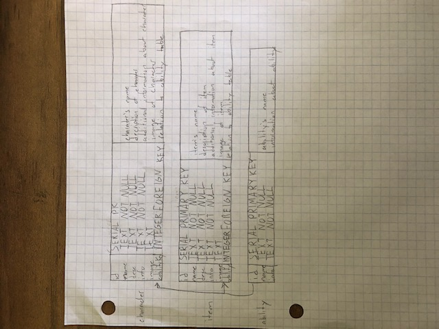
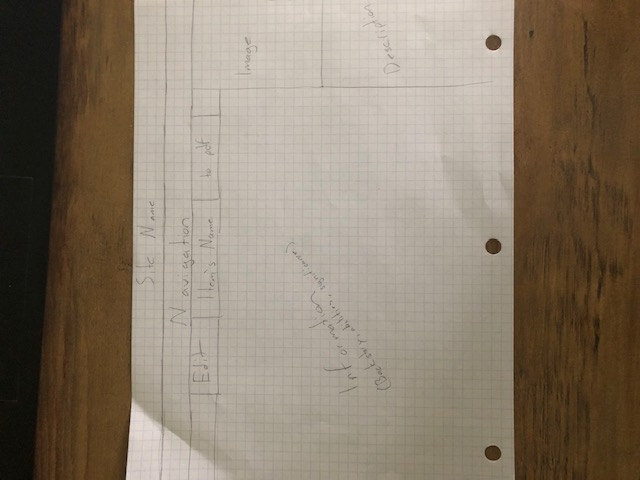
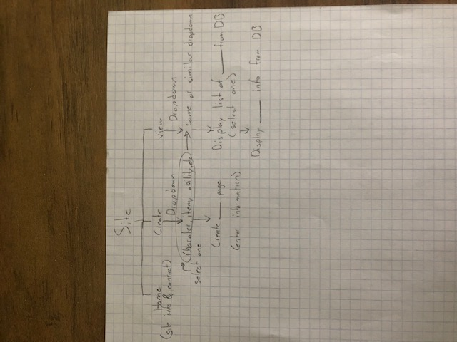

# Fantasy Bank
Fantasy Bank offers users a platform to create and store their own or previously existing characters, items, and abilities.  It will also allow users to edit the information for their own entries.

## Web service
[apilayer pdflayer](https://pdflayer.com/) API Key

- POST or GET https://api.pdflayer.com/api/convert

## Database use
At this moment I've come up with three tables; character, item, skill. The tables will hold basic information about their respective contents. These three tables will be linked to the other two tables through foregin keys. The character will be able to carry items from the item table and will have a skill from the skill table. I also plan to give items a skill from the skill table.

## Initial designs
### Page Layout

### Site Map

